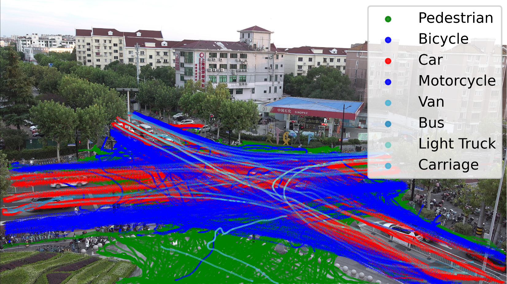
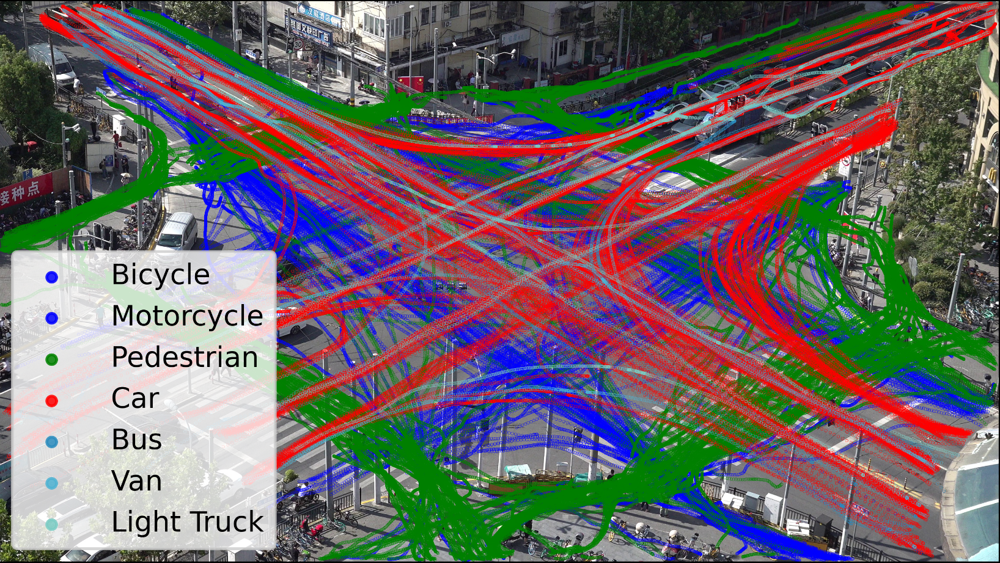
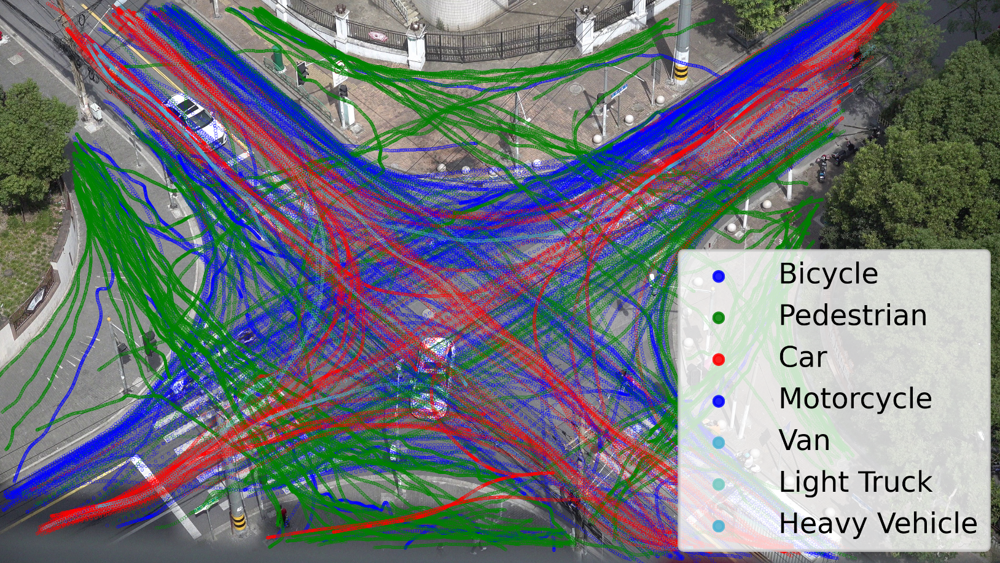
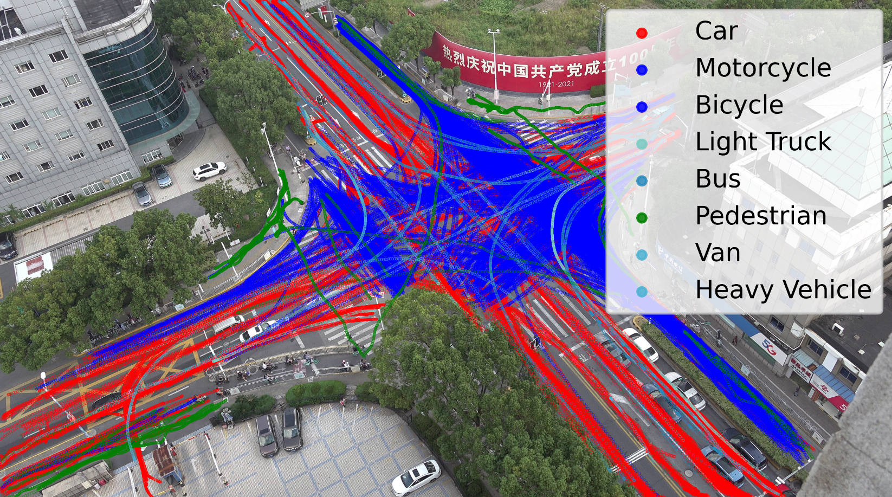
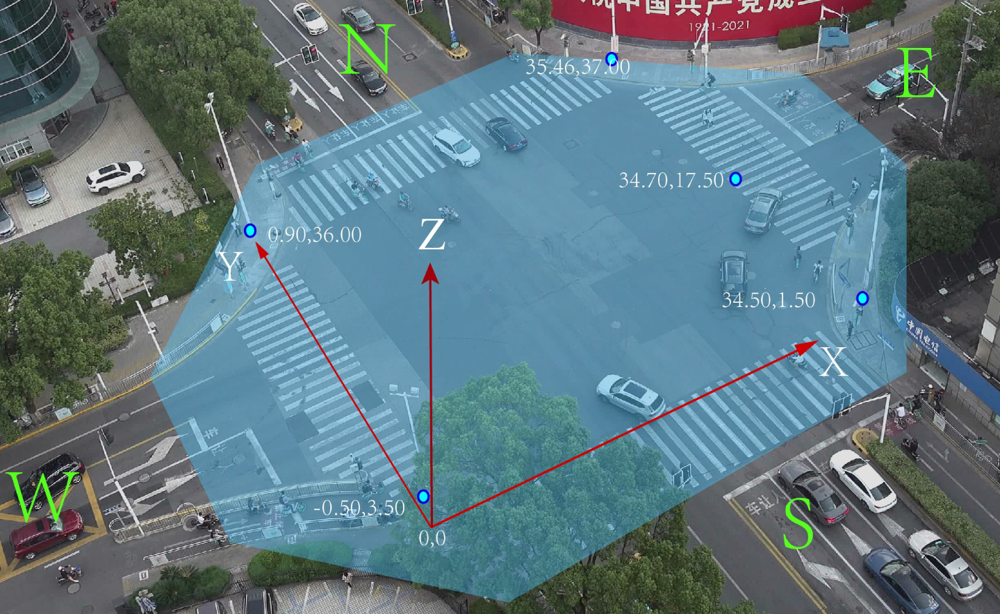
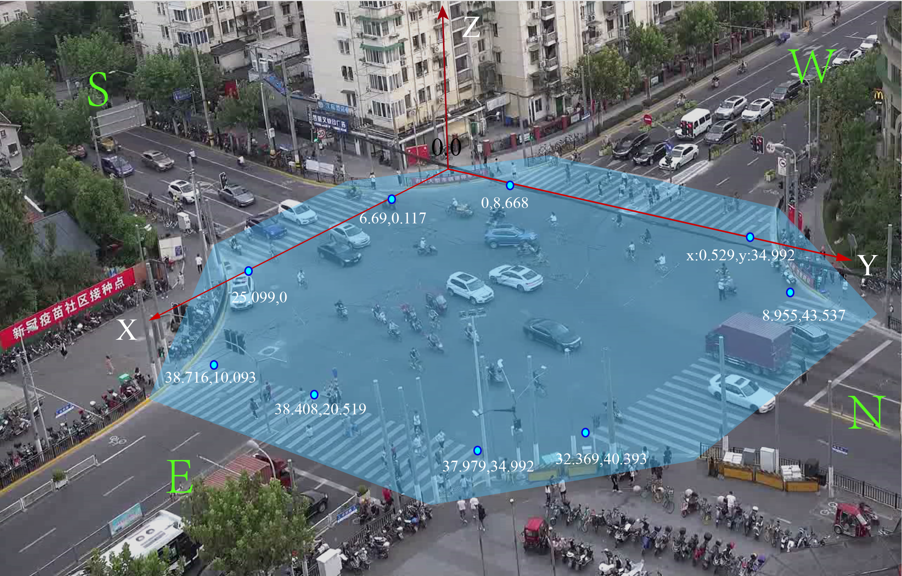
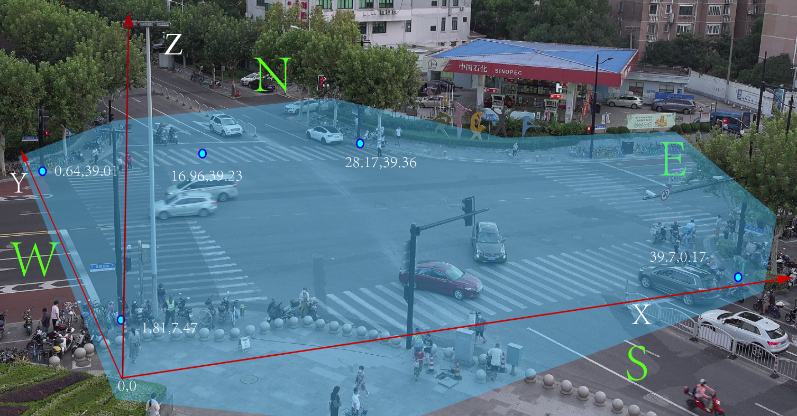
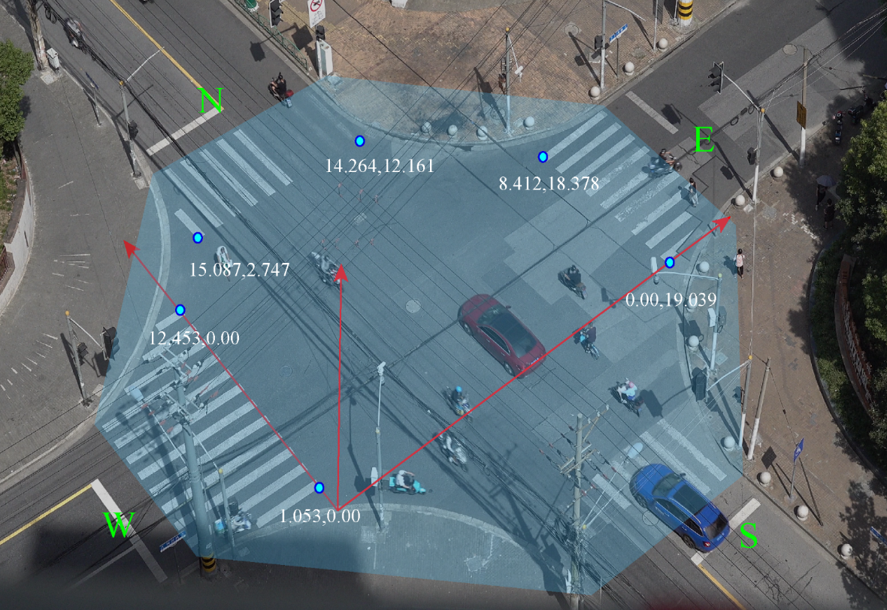
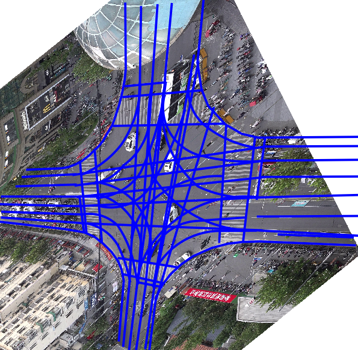
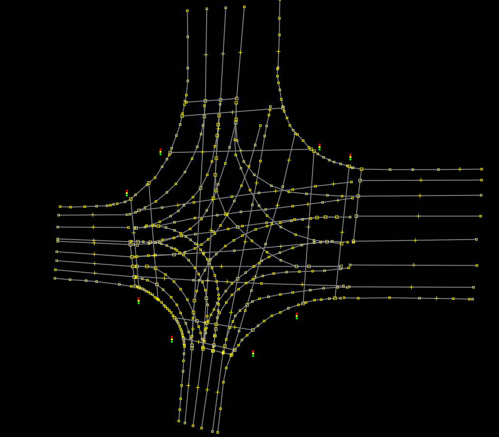

# VRU_DATA
We opened a new dataset about vulnerable road users in unban street.

# Format of the VUR_Data Trajectory dataset

| 
  
 | 
  
 |
| :----------------------------------------------------------: | :----------------------------------------------------------: |
|             a). Jianhe-Xianxia (JH) intersection             |          b). Longchang-Changyang (LC) intersection           |
| 
  
 | 
  
 |
|             c). Ningwu-Hejian (NW) intersection              |            d). Moyu-Changjidong (MY) intersection            |

                                              Fig.1 

1. **Trajectory Table:**  <kbd>JH_total.csv/LC_total.csv/MY_total.csv/NW_total.csv</kbd>  

  This file records the time-dependent vehicle trajectory and motion state parameters:

| vehicle_id | frame_time  | vehicle_type | world_x | world_y | speed_x | speed_y | acc_x   | acc_y   | Jerk_x  | Jerk_y  | Angle | video_id |
| ---------- | ----------- | ------------ | ------- | ------- | ------- | ------- | ------- | ------- | ------- | ------- | ----- | -------- |
|            | 0.04s/frame |              | [m]     | [m]     | [m/s]   | [m/s]   | [m/s^2] | [m/s^2] | [m/s^3] | [m/s^3] | rad   |          |

- vehicle_id:  the id number of the vehicle in this record	
- frame_time: time(s) of the video frame, one second corresponds to 25 frames, one frame corresponds to 0.04 seconds, the time corresponding to each data frame. 
- vehicle_type: the specific class to which the vehicle belongs(Car, Motorcycle, Van, Light Truck, Bus, Bicycle, Carriage, Pedestrian, Heavy Vehicle)	
- world_x: The world_x position of the center of the vehicle bounding box in the ground coordinate system
- world_y: The world_y position of the center of the vehicle bounding box in the ground coordinate system
- speed_x: The component of the center's velocity in the x-direction	
- speed_y: The component of the center's velocity in the y-direction	
- acc_x: The component of the acceleration at the center in the x direction	
- acc_y: The component of the acceleration at the center in the y direction	
- Jerk_x: The component of the jerk at the center in the x direction	
- Jerk_y: The component of the jerk at the center in the x direction	
- Angle: The angle between the moving direction of the center of the vehicle bounding box and the positive x-axis	
- video_id: The videos are numbered and stored in 10-minute segments, hence we assign numbers to each video.

2. **Signal Table:**  <kbd>Signal_time_data.csv</kbd>  

  The signal timing plan is recorded while capturing the operational video of the intersection, simultaneously documenting the traffic signal operation scheme.

| inters_nm | video_id | cycle_id | phase | green_begin_time | yellow_begin_time | all_red_time | red_time | GG_B_F | G_B_F | Y_B_F | AR_B_F | R_B_F | L_G  | phase_length |
| --------- | -------- | -------- | ----- | ---------------- | ----------------- | ------------ | -------- | ------ | ----- | ----- | ------ | ----- | ---- | ------------ |
|           |          |          |       |                  |                   |              |          |        |       |       |        |       |      |              |

- inters_nm: Name of the Intersection
- video_id: The videos are numbered and stored in 10-minute segments, hence we assign numbers to each video
- cycle_id: The numbering of signal cycles
- phase: The name of signal phase
- green_begin_time: The moment the green light starts.
- yellow_begin_time: The moment the yellow light starts.
- all_red_time:  The moment the all red light starts.
- red_time:  The moment the red light starts.
- phase_length: signal phase duration(s).

- Other items have the same meaning as the items with the same name in the <kbd>Veh_smoothed_tracks.csv</kbd> file.

| 
  
 | 
  
 |
| :----------------------------------------------------------: | :----------------------------------------------------------: |
|            a). Moyu-Changjidong (MY) intersection            |          b). Longchang-Changyang (LC) intersection           |
| 
  
 | 
   
 |
|             c). Jianhe-Xianxia (JH) intersection             |             d). Ningwu-Hejian (NW) intersection              |

  Fig.2.  Pixel Coordinates and World Transformation System

3.  **Map** 

***

In addition to the record file, we also provide a [high-definition map](Data/mapfile-Tianjin.osm#sdd) of the intersection in [Lanelet2](https://github.com/fzi-forschungszentrum-informatik/Lanelet2) format\(see Fig.2\), the origin of the map coincides with the origin of the ground coordinate system.  

| 
  
 | 
 
 |
| :----------------------------------------------------------: | :----------------------------------------------------------: |
|                     a). LC intersection                      |                     b). LC intersection  in osm                     |

                                                    Fig.2 Semantic HD-map in lanelet2 format
